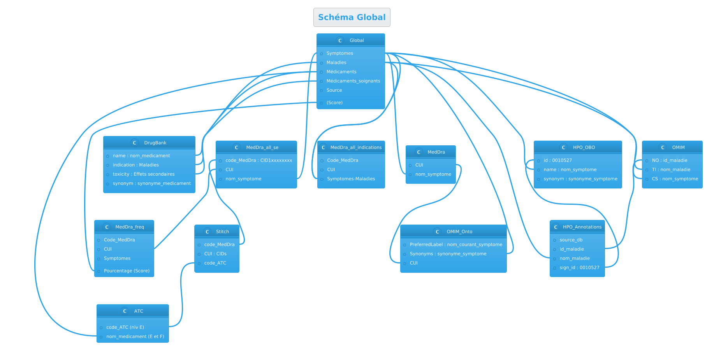

# BioDataIntegrator : Projet GMD 2024 - Système d'intégration de données biomédicales

## Description

Ce projet a pour objectif de créer un système permettant d'intégrer et d'interroger plusieurs sources de données biomédicales pour associer des **signes et symptômes**, des **maladies**, et des **médicaments**. Les utilisateurs peuvent rechercher des maladies qui pourraient causer certains symptômes ou identifier des médicaments susceptibles de provoquer ces symptômes comme effets secondaires. 

Le système suit une architecture de type **médiateur**, ce qui signifie que les données restent dans leurs sources d'origine et ne sont pas centralisées. Lors d'une requête, les résultats de chaque source sont traduits et regroupés pour être présentés de manière cohérente à l'utilisateur.

## Fonctionnalités Principales

1. **Requête par symptômes**: À partir d'un ou plusieurs symptômes, le système renvoie une liste de maladies possibles et de médicaments pouvant causer ces symptômes.
2. **Relation maladies et médicaments**: Si un symptôme est associé à une maladie, la liste des médicaments pour traiter la maladie est proposée. Si c'est un effet secondaire, une liste de médicaments pour atténuer cet effet est fournie.
3. **Opérateurs logiques**: Les requêtes peuvent être faites en utilisant les opérateurs logiques `ET` et `OU` pour affiner les résultats.

## Sources de données

Le système intègre plusieurs bases de données biomédicales :
- **DrugBank** : Informations sur les médicaments, leurs indications et effets secondaires.
- **OMIM** : Données sur les maladies génétiques et leurs signes/symptômes.
- **SIDER** : Informations sur les effets secondaires des médicaments à partir des notices d'utilisation.
- **HPO et HPO Annotations** : Ontologie des signes et symptômes humains, avec associations entre symptômes et maladies.
- **STITCH et ATC** : Informations sur les médicaments, notamment les associations avec des identifiants STITCH et des codes ATC.

## Schéma Global



Ce schéma représente notre *schéma global de médiateur*, où les données restent dans leurs sources d’origine. Lorsqu’un utilisateur fait une requête, celle-ci est traduite pour interroger les différentes sources, et les résultats sont ensuite agrégés de manière cohérente avant d’être présentés. Ce schéma permet d’illustrer la gestion des mappers utilisés pour traduire et combiner les réponses issues des différentes bases de données.


## Prérequis

- Langage utilisé : Python
- Bibliothèques : 
  - Pandas
  - SQLite3
  - Requests (pour les appels API)
  - Flask (pour l'interface utilisateur)

## Installation

1. Clonez le dépôt GitHub :
    ```bash
    git clone https://github.com/votre-utilisateur/projet-gmd-2024.git
    ```

2. Installez les dépendances :
    ```bash
    pip install -r requirements.txt
    ```

3. Mettez en place les bases de données externes (indiquées dans le fichier `data_sources.txt`).

## Usage

1. Lancer le serveur local :
    ```bash
    python app.py
    ```

2. Entrez un ou plusieurs symptômes dans le champ de recherche pour obtenir les maladies ou médicaments associés.

## Architecture

Le système est divisé en plusieurs modules :
- **Mapping/Wrapper** : Traduction des requêtes utilisateurs vers les différentes bases de données.
- **Médiation** : Agrégation des résultats provenant des différentes sources de données.
- **Interface utilisateur** : Présentation des résultats sous forme lisible et structurée.


## Fonctionnalités Avancées

- Utilisation de **synonymes** pour améliorer la recherche.
- Prise en charge des opérateurs **logiques** `ET` et `OU` dans les requêtes.
- Tri des résultats en fonction de leur **pertinence**.
- Visualisation des résultats avec des graphes interactifs.

## Contributeurs

- Joannès Guichon (lead dev)
## Pour les commits: 

- fonctionnalité – une nouvelle fonctionnalité est introduite avec les modifications
- correctif – un correctif de bug a été effectué
- tâche – changements qui ne sont pas liés à un correctif ou à une fonctionnalité et qui ne modifient pas les fichiers src ou test (par exemple, la mise à jour des dépendances)
- refactorisation – code refactorisé qui ne corrige pas un bug ni n'ajoute une fonctionnalité
- documentation – mises à jour de la documentation, comme le fichier README ou d'autres fichiers markdown
- style – changements qui n'affectent pas le sens du code, probablement liés à la mise en forme du code, comme les espaces, les points-virgules manquants, etc.
- test – ajout de nouveaux tests ou correction des tests précédents
- performance – améliorations de la performance
- intégration continue – relatif à l'intégration continue
- construction – changements qui affectent le système de construction
